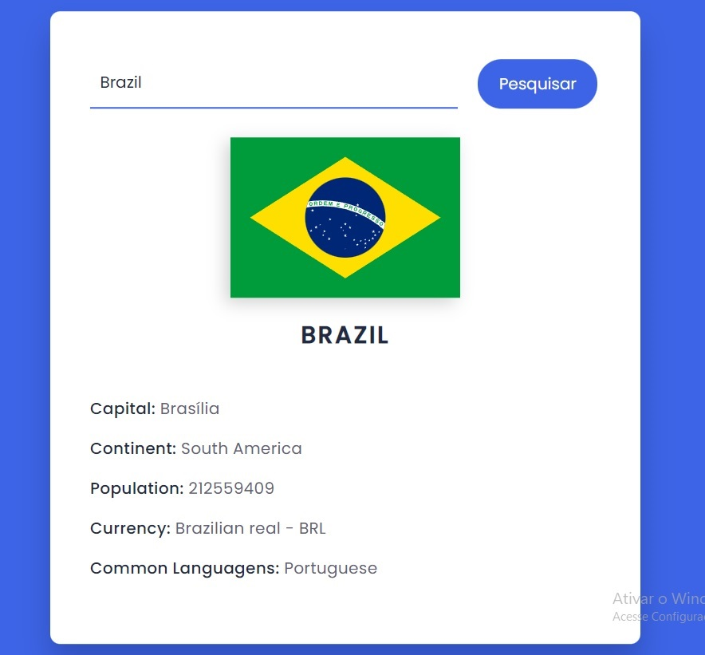

<h1 align="center"> CountryGuid </h1>

  <a href="#-tecnologias">Tecnologias</a>&nbsp;&nbsp;&nbsp;|&nbsp;&nbsp;&nbsp;
  <a href="#-projeto">Projeto - </a>&nbsp;&nbsp;&nbsp;|&nbsp;&nbsp;&nbsp;
  <a href="#-layout">Layout</a>&nbsp;&nbsp;&nbsp;|&nbsp;&nbsp;&nbsp;

 

  

## 🚀 Tecnologias

Esse projeto foi desenvolvido com as seguintes tecnologias:

- HTML e CSS
- JavaScript e API Restful
- Git e Github

## 💻 Projeto

O Country Guid é um projeto que mostra algumas informções sobre os países do mundo.

## 🔖 Layout

Você pode visualizar o layout do projeto através [DESSE LINK](<https://www.figma.com/file/y2VMokS0lyXIeNMz6Jkp0J/Calend%C3%A1rio-de-Jogos-(Community)?node-id=301%3A1812>).

---

